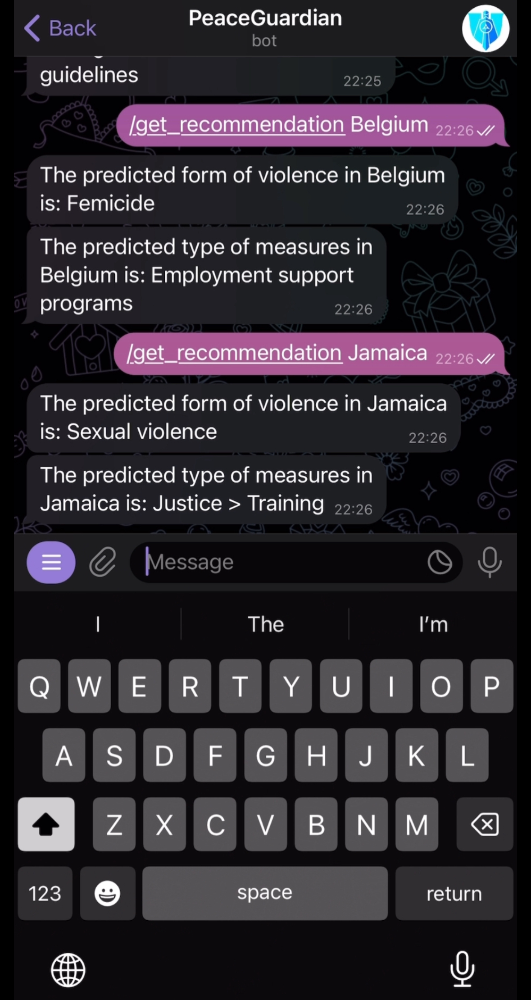

# Project Report: Analysis of Domestic Violence Data

Link to the video we uploaded to Youtube: https://www.youtube.com/watch?v=d9iojRTKYQI

## Introduction
The aim of this project is to analyze domestic violence data from various sources to gain insights into the prevalence, patterns, and contributing factors of domestic violence globally. By leveraging advanced data analysis techniques and machine learning algorithms, we seek to uncover valuable information that can inform policymakers, researchers, and organizations working to address the issue of domestic violence.
### Problem: 
Domestic violence is a widespread and serious social problem with negative consequences for victims and society as a whole. Despite widespread recognition of the problem, analyzing and understanding the factors contributing to domestic violence remains challenging due to its diversity and deep internal complexity. 

Our project aims to overcome these challenges by using a comprehensive approach to analyzing domestic violence data to identify patterns, risk factors and differences between regions. To achieve this goal, we apply machine learning techniques and data visualization tools to extract valuable information that can be used by policymakers, researchers, and organizations working to prevent and mitigate the effects of domestic violence. 

### Literature review with links (another solutions). 

1. **Data Extraction from Government Websites**:
   - We utilize custom web scraping tools to extract data from government websites, navigating dynamic content with advanced algorithms. This article provides insights into crafting custom scraping tools: [How to Extract Data from Any Government Website](https://3idatascrapingblog.medium.com/how-to-extract-data-from-any-government-website-b7027897b187)

2. **Creating a Telegram Bot**:
   - Constructing your own Telegram bot requires meticulous development. This guide walks you through the process and provides a systematic guide: [How to Create Your Own Telegram Bot](https://medium.com/spidernitt/how-to-create-your-own-telegram-bot-63d1097999b6)

3. **Integrating ChatGPT with Telegram**:
   - Seamlessly integrating ChatGPT with Telegram requires a strategic approach. This article offers insights and a systematic guide for the integration process: [How to Integrate ChatGPT with Telegram](https://medium.com/@mirceaiosif/how-to-integrate-chatgpt-with-telegram-8b8d6075f955)

4. **BERT for Everyone Tutorial**:
   - Utilizing BERT for effective implementation is detailed in this tutorial. It offers custom-tailored solutions and a systematic tutorial for integration: [BERT for Everyone Tutorial Implementation](https://www.kaggle.com/code/harshjain123/bert-for-everyone-tutorial-implementation)

5. **Data Manipulation in Python with Pandas**:
   - This practical tutorial and implementation guide enhances proficiency in data manipulation using Pandas: [Optimizing Data Manipulation in Python with Pandas](https://www.geeksforgeeks.org/data-manipulattion-in-python-using-pandas/)

6. **Libraries for Data Manipulation in Python**:
   - Exploring diverse Python libraries for data manipulation enriches project capabilities. This article outlines key libraries and their applications: [Libraries for Data Manipulation in Python](https://clouddevs.com/python/libraries-for-data-manipulation/)

7. **Basics of Machine Learning with TensorFlow**:
   - This resource provides fundamental insights into machine learning, offering custom solutions and a systematic approach: [Basics of Machine Learning with TensorFlow](https://www.tensorflow.org/resources/learn-ml/basics-of-machine-learning?hl=ru)

### Current work (description of the work). 

In this stage of our project, we have transitioned from utilizing Google Colab to employing Visual Studio Code (VS Code) for our work. Our primary objective remains unchanged: to conduct scientific research integrating cutting-edge methodologies such as the BERT model, Python for data manipulation, establishing a database, and employing TensorFlow for machine learning purposes. 

Instead of Google Colab, we have opted for VS Code due to its flexibility and compatibility with our workflow requirements. This transition has allowed us to maintain a structured approach to data processing while leveraging the functionalities and features offered by VS Code. 

Our focus remains on integrating diverse datasets sourced from various channels into the VS Code environment. This enables us to maintain a systematic approach to data manipulation and analysis. 

Additionally, we are enhancing user interaction and accessibility by incorporating a Telegram bot tailored to our project theme. This bot not only serves as an information provider but also offers supplementary features to enhance user experience. 

As part of our current work, we are actively engaged in refining our methodologies, optimizing code implementation, and ensuring seamless integration of different components within the VS Code environment. This includes streamlining data processing pipelines, fine-tuning machine learning algorithms, and enhancing the functionality of the Telegram bot to meet the evolving needs of our project. 

Our ongoing efforts are directed towards achieving our project objectives efficiently within the VS Code environment while maintaining a focus on innovation, usability, and the delivery of valuable insights into the domain of domestic violence research. 

## Data and Methods
### Information about the data.
The dataset encompasses information spanning from 2000 to 2024, covering a variety of forms of violence and associated measures to combat them. Utilizing this dataset, we have created a sophisticated model capable of predicting the accuracy and efficacy of different measures and forms of violence based on the country in question. 

### Description of the ML/DL models we used with some theory.
In our model, we utilized several libraries and packages, including **'pandas'** for data manipulation and analysis, **'Scikit-learn (sklearn)'** for machine learning tasks such as preprocessing and model evaluation. Scikit-learn is a widely used open-source machine learning library written in Python that offers an array of methods for classification, regression, covariance matrix estimation, dimensionality reduction, data pre-processing, and benchmark problem generation. Additionally, we used **'joblib'** for saving and loading trained models, **'telegram'** for building a Telegram bot, **'matplotlib'** for data visualization, and 'os' for operating system-related tasks. 

Our model aims to determine the most common form of violence per country by grouping the data by country and finding the mode of 'Form of Violence' for each country. To accomplish this, we utilized the train_test_split method from scikit-learn, which provides efficient tools for data analysis and modeling, to split the dataset conveniently into training and test sets. 

We trained a RandomForestClassifier model with 100 estimators on the training data. This choice was made due to the classifier's capability of handling multiple classes directly. 

The Telegram bot we developed has several functionalities, including: 

- **'start'** command. 

- **'get_recommendation'** command. 

- **'show_chart'** command. 

## Results
As a result of developing a **Telegram-bot** that uses neural networks to provide information about various forms of violence around the world in order to warn tourists about potential dangers in the country they are going to visit, we implemented the following commands:

- Command **'start'**: The bot responds to introductory and help requests respectively, providing users with the necessary information about the bot's functionality.

- **'get_recommendation'** command: This command takes a country name as input, encodes it using the loaded label encoder and then makes predictions using the loaded model to provide recommendations.

- **'show_chart'** command: This command creates charts based on country data, including the percentage of each type of measure and form of violence. The generated charts are saved as images, sent to the user and then deleted.

## Discussion
Our project aims to address the complex issue of violence through a comprehensive analysis utilizing advanced machine learning techniques and data visualization tools. Recognizing the challenges inherent in understanding and combating violence, we have adopted a multifaceted approach to identify patterns, risk factors, and regional disparities associated with this pervasive social problem. 

To this end, our model seeks to predict the most common form of violence per country using machine learning techniques. We leverage a dataset containing information on various forms of violence and associated measures across different countries. Categorical features such as 'Country' are encoded using label encoding techniques to prepare the data for model training. We train a RandomForestClassifier model with 100 estimators on the dataset to predict the most common form of violence for each country. We evaluate the model's performance using accuracy metrics to assess its ability to predict the most common form of violence correctly. We then integrate the trained model into a Telegram bot, which allows users to interact with the model by providing country names and receiving predictions on the most common form of violence. The Telegram bot also provides users with visualizations, such as charts showing percentages of each type of measure and form of violence in a given country. 

As we look to the future, we aim to incorporate additional features and data sources to enhance the model's predictive capabilities and robustness. We also plan to incorporate natural language processing (NLP) techniques to facilitate intuitive and interactive user interactions. Furthermore, we aspire to foster collaborations with domain experts, researchers, and organizations working in the field of domestic violence prevention to leverage collective expertise and resources. 

In conclusion, our project represents a holistic and data-driven approach to addressing domestic violence. By continually refining our methodologies and leveraging emerging technologies, we hope to make meaningful contributions to the ongoing efforts aimed at preventing and mitigating the impacts of domestic violence worldwide. 

## Sources: 
- Kramer, O., & Kramer, O. (2016). Scikit-learn. Machine learning for evolution strategies, 45-53. 

- Douglass, M. (2020). Hands-on Machine Learning with Scikit-Learn, Keras, and Tensorflow, 2nd edition by Aurélien Géron. Physical and Engineering Sciences in Medicine, 43(3), 1135–1136. https://doi.org/10.1007/s13246-020-00913-z 

 